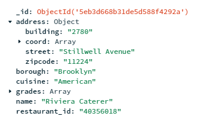

# MongoDB Data
The backend-mongoDB code is connected to a mongoDB database and has the following collections:
- __restaurants__ been populated the mongoDB sample dataset.
- __reviews__ populated by users 

## Restaurants Collection
- sample document 

    

- Required fields
    - **_id**: object ID
    - **address** 
        - for filter by zipcode and google maps link
    - **cuisine** 
        - for filter by cuisine
    - **name**
        - for search by name
    - **restaurant_id**

## Reviews Collection
- sample document
